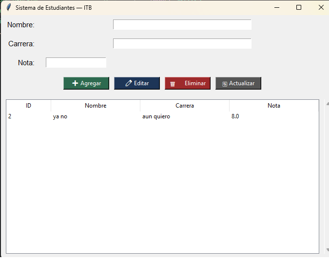

# Sistema de Estudiantes — ITB

¡Bienvenido al **Sistema de Estudiantes — ITB**! Este es un proyecto de escritorio desarrollado en **Python** que implementa una interfaz gráfica de usuario (GUI) utilizando **Tkinter** y almacenamiento de datos local mediante **SQLite3**. 

El sistema permite gestionar de manera ágil el registro de alumnos, sus carreras y calificaciones correspondientes bajo un patrón CRUD completo (Crear, Leer, Actualizar, Borrar).

## 🚀 Características

- **Operaciones CRUD Completas:**
  - `➕ Agregar`: Registra nuevos estudiantes con validaciones de campos obligatorios y formato numérico para las notas.
  - `✏️ Editar`: Modifica la información del alumno seleccionado directamente desde la interfaz.
  - `🗑️ Eliminar`: Remueve registros con una ventana emergente de confirmación de seguridad.
  - `🔄 Actualizar`: Refresca la vista de datos de la base de datos en tiempo real.
- **Persistencia de Datos:** Uso de SQLite3, creando automáticamente un archivo de base de datos local (`estudiantes.db`) si no existe.
- **Interfaz Intuitiva:** Tabla estructurada mediante `ttk.Treeview` que permite cargar datos automáticamente en los campos de texto al hacer clic en una fila.
- **Diseño Responsivo:** Soporte de redimensionamiento de ventana gracias a una correcta configuración de pesos (`grid_rowconfigure`/`grid_columnconfigure`).

## 📸 Captura de Pantalla

Aquí puedes observar la interfaz del sistema en ejecución:



## 🛠️ Tecnologías Utilizadas

- **Python 3.x**
- **Tkinter / TTK** (Interfaz Gráfica integrada en Python)
- **SQLite3** (Motor de Base de Datos relacional integrado)

## 📋 Requisitos Previos

No necesitas instalar librerías externas de terceros, ya que todas las dependencias forman parte de la biblioteca estándar de Python. Asegúrate de tener Python instalado en tu sistema:

- Descargar Python desde [python.org](https://www.python.org/)

## 🔧 Instalación y Ejecución

1. **Clona este repositorio** en tu máquina local:
   ```bash
   git clone [https://github.com/TU_USUARIO/TU_REPOSITORIO.git](https://github.com/TU_USUARIO/TU_REPOSITORIO.git)
